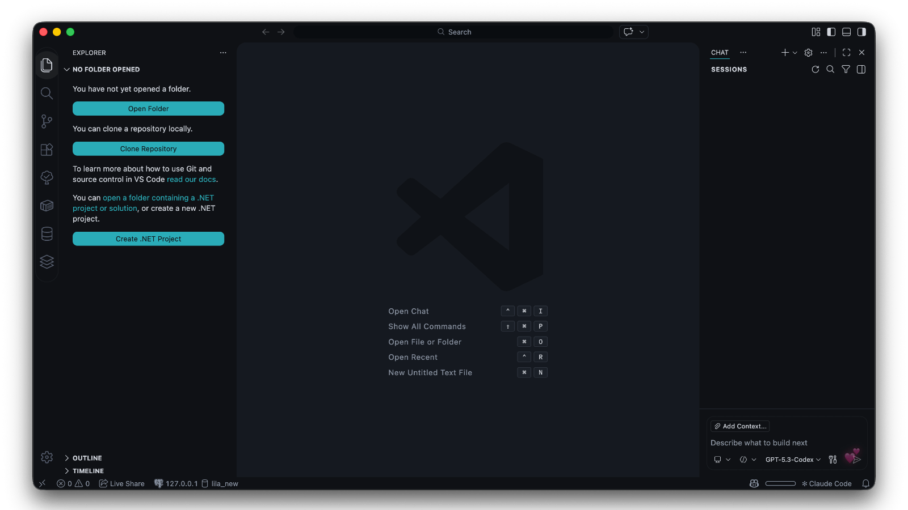
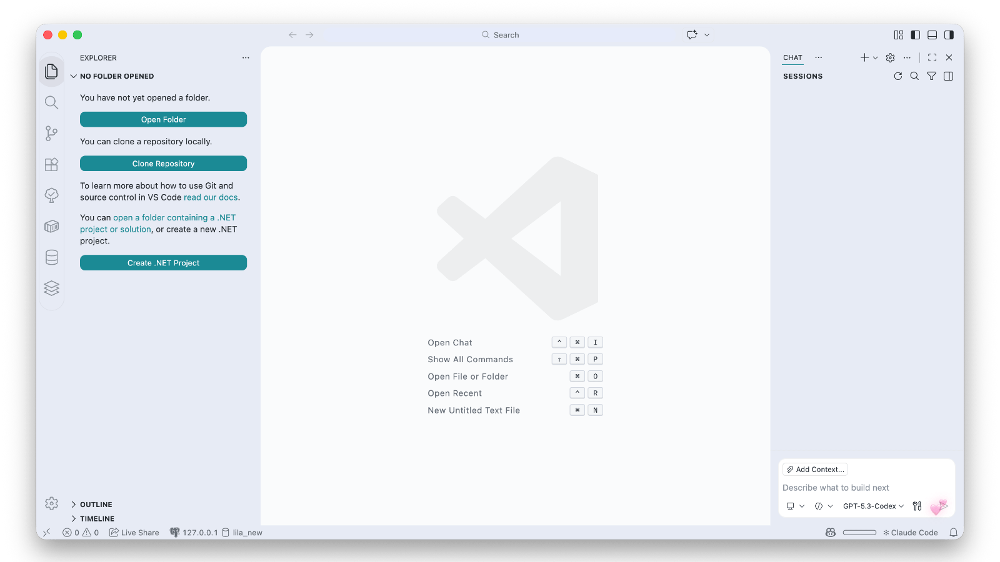
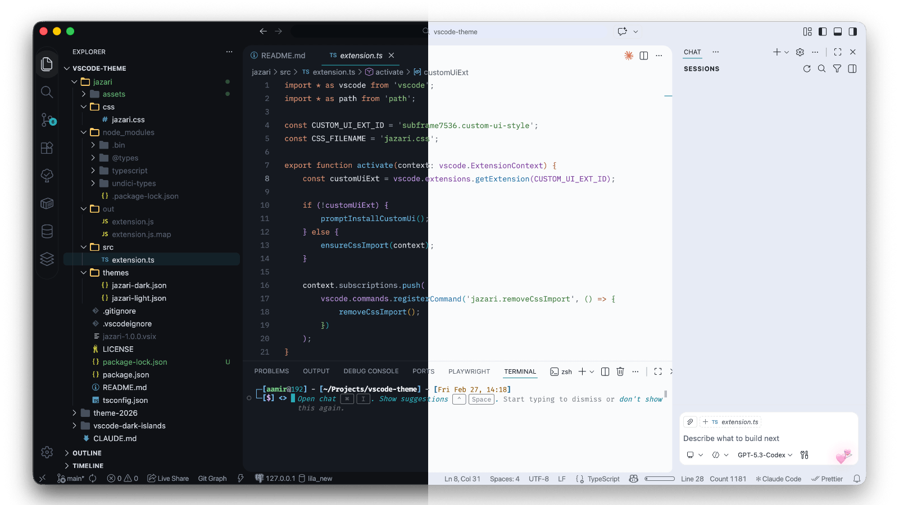

# Jazari

Dark and light VS Code theme. Teal accent, rounded floating panels, backdrop blur, zero noise.


## Preview





## Features

**Theme colors** cover the full VS Code surface: editor, sidebar, activity bar, tabs, terminal, status bar, title bar, panels, notifications, debug toolbar, peek view, diff editor, notebooks, settings, welcome page, breadcrumbs, git decorations, and more.

**Syntax highlighting** with semantic token support for JavaScript, TypeScript, JSX/TSX, Python, Go, Rust, CSS/SCSS/LESS, HTML, JSON, YAML, Markdown, Shell, and regex.

**CSS layout customizations** (optional, via [Custom UI Style](https://marketplace.visualstudio.com/items?itemName=subframe7536.custom-ui-style)):

- Unified rounded panels for editor, bottom panel, and auxiliary bar
- Transparent sidebar internals that inherit the theme background
- Rounded floating widgets (command palette, context menus, notifications, IntelliSense)
- Pill-shaped activity bar container
- Rounded inputs, buttons, list items, and scrollbar thumbs
- Conditional corner rounding that adapts when panels are shown or hidden

## Installation

**From VS Code Marketplace (recommended):**

Search `Jazari` in the Extensions sidebar, or run in the Command Palette:

```
ext install aala.jazari
```

**From GitHub releases (VSIX):**

1. Download `jazari-x.x.x.vsix` from the [latest release](https://github.com/aalasolutions/vscode-jazari/releases/latest).
2. Install it:

   - **VS Code UI:** Extensions sidebar > `...` menu > **Install from VSIX** > select the file
   - **Command line:**
     ```
     code --install-extension jazari-x.x.x.vsix
     ```

3. Select your theme variant: `Cmd+K Cmd+T` (Mac) or `Ctrl+K Ctrl+T` (Windows/Linux), choose **Jazari Dark** or **Jazari Light**.
4. Reload VS Code when prompted.

## Two in One

Jazari ships as a complete color theme AND a UI layout system. Each works independently:

**As a color theme only:** Select Jazari Dark or Jazari Light. No additional dependencies required.

**As a UI system only:** Keep your existing color theme. Install [Custom UI Style](https://marketplace.visualstudio.com/items?itemName=subframe7536.custom-ui-style) and Jazari will inject its CSS automatically. You get the floating panels, rounded surfaces, glass effects, and adaptive corner logic without changing your current theme colors.

**Both together:** The intended Jazari experience. Color and layout designed as a system.

## CSS Customizations

Jazari's full UI depends on [Custom UI Style](https://marketplace.visualstudio.com/items?itemName=subframe7536.custom-ui-style). Rounded panel geometry, floating surfaces, transparency balance, and adaptive corner behavior are part of the theme system, not just add-ons.

To remove the CSS customizations, open the Command Palette and run:

```
Jazari: Remove CSS Customizations
```

This cleans up the import from Custom UI Style without requiring manual edits to your settings.

## Requirements

- VS Code 1.89+
- [Custom UI Style](https://marketplace.visualstudio.com/items?itemName=subframe7536.custom-ui-style) (required for the intended Jazari UI)

## Build from Source

```bash
git clone https://github.com/aalasolutions/vscode-jazari.git
cd vscode-jazari
npm install
npm run compile
npx @vscode/vsce package
```

This produces `jazari-x.x.x.vsix`. Install it with:

```bash
code --install-extension jazari-x.x.x.vsix
```

## Troubleshooting

**Panels not rounded, no glass effects, or UI looks off:**

The CSS customizations may not be loading. Open your VS Code settings JSON (`Cmd+Shift+P` > **Open User Settings (JSON)**) and check `custom-ui-style.external.imports`:

```json
"custom-ui-style.external.imports": [
  "file:///Users/yourname/.vscode/extensions/aala.jazari-1.2.1/css/jazari.css"
]
```

The path must match your installed publisher (`aala`) and version number. If it points to an outdated path (e.g. `aalasolutions.jazari-1.0.0`), remove that entry, then run `Cmd+Shift+P` > **Custom UI Style: Reload** to apply. Jazari will re-inject the correct path automatically on the next startup.

## Why "Jazari"?

Named after **Al-Jazari** (1136-1206), the Muslim polymath and mechanical engineer who built the world's first programmable machines. His work on automata and engineering laid foundations that echo through every line of code we write today.

## License

MIT

## Credits

Built by [AALA IT Solutions](https://aalasolutions.com).
